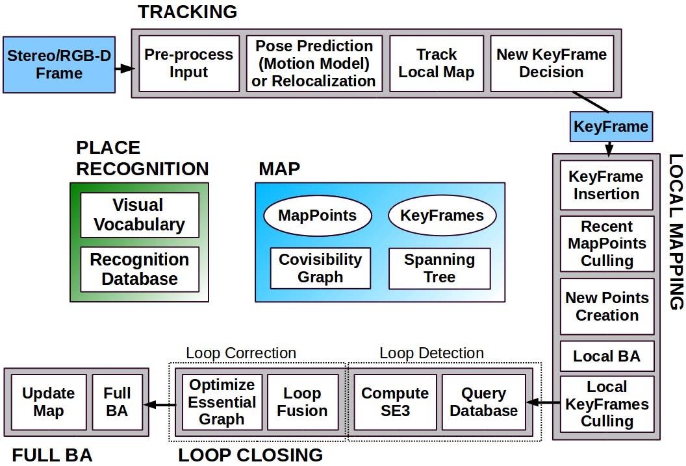

# ORB-SLAM2代码解读

## 1.   SYSTEM OVERVIEW

ORB-SLAM2主要由3个模块组成，分别为Tracking, Mapping和Loop closing. 如下图所示：
每个模块对应一个线程，另外还有viewer线程用于显示，执行完Loop closing后还会开启一个全局BA线程。

### 1.1 Monocular

#### 1.1.0 初始化

地图初始化的目标是通过两帧之间的相对位姿来三角化初始Map point，步骤如下：
1. 提取两帧的关键点，并进行关键点匹配。
2. 分别使用normalized DLT和8-point方法求解homography(H)和fundamental(F)矩阵，每次迭代，分别计算H和F的分数$S_H$和$S_F$，并保留最大的一个H和F。
3. 在小视差或平面的情况下，应该选择homography，否则在大视差或非平面的情况下，应该选择fundamental。根据$R_H=\frac{S_H}{S_H+S_F}$决定使用哪个方案，若$R_H>0.45$使用homography，否则使用fundamental。
4. 对于Homography matrix, 求解会有8个可能的结果，对于每个解，将求解用的8个点三角化，选择<font color=red>有视差、深度为正的点最多且重投影误差较低</font>的一个解。对于fundamental matrix，将其转换为essential matrix后求解，会有4个解，选择策略与homography相同。
5. 通过BA优化得到的位姿。

#### 1.1.1 Tracking

得到一帧图像后，首先提取ORB特征点，然后和前一帧做特征匹配，并且通过motion-only BA优化位姿，若追踪丢失则通过place recognition进行全局重定位。得到初始位姿后，通过covisibiity graph获得local visible map，然后通过重投影，将当前帧与local map进行关键点匹配，进一步进行位姿的优化。最后，决定是否插入一个新的关键帧。

1. 提取ORB特征点
首先构建图像金字塔，共8层，scale factor为1.2，对每层的图像，将其划分为grid，在每个grid上提取特征点，并计算其方向和描述子。

2. 位姿估计
    1. 若上一帧tracking成功，则使用运动模型，即认为相机做匀速运动，通过上一帧运动来预测当前帧的位姿。然后在上一帧中查找当前帧对应关键点（根据初始位姿投影过去的位置附近）<font color = red>（guided search）</font>，若匹配点太少，则扩大搜索范围。最后通过匹配到的点进行位姿优化。
    2. 若上一帧tracking失败，则进行全局重定位，使用BoW在关键帧数据库中查找候选关键帧，并分别与每一个关键帧进行关键点匹配。然后使用PnP和RANSAC计算当前帧位姿。若有足够的inlier，则进行位姿优化，并在上一帧中查找当前帧对应关键点（根据初始位姿投影过去的位置附近）<font color = red>（guided search）</font>，并根据匹配到的点再次进行位姿优化。

3. Track local Map
local map包括$K_1$:与当前帧有共同map point的关键帧，$K_2$: 在covisibility graph中与$K_1$相连的关键帧，$K_{ref}$: 与当前帧有最多共同map point的一个关键帧， $K_{ref} \in K_1$。
把local map投影到当前帧，对$K_1$和$K_2$中的每个map point(P)进行如下操作：
    1. 计算P在当前帧中的位置x，若超出图像边界，则丢弃。
    2. 计算P在当前帧中的视角方向与平均视角方向的夹角，若大于60$\degree$，则丢弃。
    3. 计算P到相机中心的距离d，若d不在P的<font color = red>scale invariance region</font>内，即$d \notin [d_{min}, d_{max}]$，则丢弃。
    4. 计算P的scale level（$d/d_{min}$）。
    5. 计算P的最具代表性的描述子和在预测的scale level中x周围还未匹配的特征点的匹配情况，并且将P和匹配最好的特征点关联。

4. 新关键帧的插入
在local mapping阶段会有关键帧的culling，因此在此阶段会尽可能多的插入关键帧。当前帧若要成为关键帧，需要满足以下几个条件，其中1确保一个好的重定位，3确保一个好tracking，4说明场景有变化，若插入关键帧时，local mapping正在工作，则通知其停止BA，优先处理新的关键帧。
    1. 距离上次重定位超过20帧。
    2. lcoal mapping空闲或距离上次插入关键帧超过20帧。
    3. 当前帧tracking的点的数量大于50个。
    4. 当前帧tracking的点的数量少于参考关键帧的90%。

#### 1.1.2 Local Mapping


#### 1.1.3 Loop Closing


类|文件|描述
--|--|--
Tracking|`Tracking.cc`|追踪线程，相机位姿计算及优化，关键帧的选择
LocalMapping|`LocalMapping.cc`|局部地图管理
LoopClosing|`LoopClosing.cc`|回环检测
System|`System.cc`|系统入口，管理所有线程
Map|`Map.cc`|地图类
MapPoint|`MapPoint.cc`|地图点类，每个点储存：世界坐标系中的三维坐标，平均视角方向，一个具有代表性的描述子，该点可以被观察到的最大和最小距离
Frame|`Frame.cc`|帧类
KeyFrame|`KeyFrame.cc`|关键帧类，包括：该帧的相机位姿$T_{cw}$，相机内参，该帧所有的特征点及其是否对应于一个MapPoint
viewer|`viewer.cc`|可视化
FrameDrawer|`FrameDrawer.cc`|
MapDrawer|`MapDrawer.cc`|
ORBextractor|`ORBextractor.cc`|提取ORB特征点

## 2. stereo代码解读

### 1. `stereo_kitti.cc` : 程序入口

```C++
LoadImages(); // 加载左右图像的路径及其时间戳
ORB_SLAM2::System SLAM(); // 初始化SLAM系统对象(2.1)
for(int ni=0; ni<nImages; ni++){ // 循环读取图像
    SLAM.TrackStereo(imLeft,imRight,tframe); // 把图像传递给SLAM系统对象(2.2)
}
SLAM.Shutdown(); // 停止所有线程
SLAM.SaveTrajectoryKITTI(); // 保存轨迹
```

### 2.1 `System::system()` : SLAM系统的初始化

```C++
mpVocabulary = new ORBVocabulary();
mpVocabulary->loadFromTextFile(strVocFile); //加载ORB词典
mpKeyFrameDatabase = new KeyFrameDatabase(*mpVocabulary); // 创建关键帧数据库
mpMap = new Map(); // 创建地图
mpFrameDrawer = new FrameDrawer(mpMap);
mpMapDrawer = new MapDrawer(mpMap, strSettingsFile); // 创建可视化对象

mpTracker = new Tracking(); // 创建Tracking对象(3.1)

mpLocalMapper = new LocalMapping();
mptLocalMapping = new thread(); // 创建LocalMapping对象并启动线程

mpLoopCloser = new LoopClosing();
mptLoopClosing = new thread(); // 创建LoopClosing对象并启动线程

mpViewer = new Viewer();
mptViewer = new thread(); // 创建Viewer对象并启动线程

// 设置线程之间的指针
```

### 2.2 `System::TrackStereo()` : Tracking线程（主线程）

```C++
// 判断是否更改模式（定位，定位与建图）
// 判断是否重置
cv::Mat Tcw = mpTracker->GrabImageStereo(imLeft,imRight,timestamp); // 输入图像，获得变换位姿(3.2)
```

### 3.1 `Tracking::Tracking()` : Tracking初始化 

```C++
// 加载相机参数（内参、去畸变参数、基线、帧率、ORB参数等）
mpORBextractorLeft = new ORBextractor();
mpORBextractorRight = new ORBextractor(); // 初始化左右图像的ORB特征提取器(5.1)
mThDepth = mbf*(float)fSettings["ThDepth"]/fx; // 设置远近点阈值
```

### 3.2 `Tracking::GrabImageStereo()` : 输入图像处理  

```C++
cvtColor(mImGray,mImGray,CV_RGB2GRAY);
cvtColor(imGrayRight,imGrayRight,CV_RGB2GRAY);  //图像转换为灰度图
mCurrentFrame = Frame(); //构造Frame(4.1)

Track(); // (3.3)
```

### 3.3 `Tracking::Track()` : Tracking线程（主线程）

```C++
StereoInitialization(); // 第一帧初始化(3.4)
mpFrameDrawer->Update(this); // 更新FrameDrawer

if(!mbOnlyTracking){ // 定位与建图模式
    if(mState==OK){
        // 检查上一帧中地图点是否被标注为替换，若有则真正执行替换操作
        CheckReplacedInLastFrame();
        // 若距离近，通过参考关键帧來Tracking(3.5)
        bOK = TrackReferenceKeyFrame(); 
        // 若有运动模型，通过运动模型來Tracking(3.6)
        bOK = TrackWithMotionModel();
    }else{ 
        // 丢失，重新定位(3.7)
        bOK = Relocalization();
    }
}else{ // 定位模式
    if(mState==LOST){
        // 追踪丢失，重新定位(3.7)
        bOK = Relocalization();
    }else{
        // 若上一帧中追踪到了足够多的MapPoint
        if(!mbVO){
            // 若距离近，通过参考关键帧來Tracking(3.5)
            bOK = TrackReferenceKeyFrame(); 
            // 若有运动模型，通过运动模型來Tracking(3.6)
            bOK = TrackWithMotionModel();
        // 若上一帧中追踪到的MapPoint太少
        }else{
            // 进行tracking(3.6)与重定位(3.7)，若重定位成功，则使用重定位结果，否则若Tracking成功，则使用tracking结果
            bOKMM = TrackWithMotionModel();
            bOKReloc = Relocalization();
        }
    }
}
// 局部地图追踪, 更新局部地图(3.8)
TrackLocalMap();
// 更新运动模型
 mVelocity = mCurrentFrame.mTcw*LastTwc;
// 清除在UpdateLastFrame中创建的临时MapPoint
// 创建新的关键帧
```

### 3.4 `Tracking::StereoInitialization()` : 双目、RGBD初始化

```C++
if(mCurrentFrame.N>500)  // 关键点数量必须大于500
    mCurrentFrame.SetPose(); // 设置当前帧为位姿为坐标原点
    KeyFrame* pKFini = new KeyFrame(); // 创建初始关键帧，并将该帧插入到地图中(6.1)
    // 对于深度大于0的关键点
    MapPoint* pNewMP = new MapPoint(x3D,pKFini,mpMap); // 创建MapPoint
    pNewMP->AddObservation(pKFini,i); // 该关键帧可以观测到该点
    pKFini->AddMapPoint(pNewMP,i); // 向该关键帧添加地图点
    pNewMP->ComputeDistinctiveDescriptors(); // 为该点选择一个“最好”的描述子
    pNewMP->UpdateNormalAndDepth(); // 更新该点的平均方向
    mpMap->AddMapPoint(pNewMP); // 向地图中添加点

    mpLocalMapper->InsertKeyFrame(pKFini); // 向局部建图线程中插入一个关键帧
```

### 3.5 `Tracking::TrackReferenceKeyFrame()` : 通过参考关键帧进行Tracking

```C++
// 计算当前帧的词袋表示
mCurrentFrame.ComputeBoW();
// 计算当前帧与参考关键帧的关键点匹配
matcher.SearchByBoW(mpReferenceKF,mCurrentFrame); 
// 将上一帧位姿的位姿作为该帧的初始位姿
mCurrentFrame.SetPose(mLastFrame.mTcw); 
// 位姿优化
Optimizer::PoseOptimization(&mCurrentFrame); 
// 舍弃outlier点
```

### 3.6 `Tracking::TrackWithMotionModel()` : 通过运动模型进行Tracking

```C++
// 更新上一帧位姿
UpdateLastFrame();
// 根据上一帧的运动设置初始值
mCurrentFrame.SetPose(mVelocity*mLastFrame.mTcw);
// 通过投影匹配前后帧的关键点
matcher.SearchByProjection(mCurrentFrame,mLastFrame,th,);
// 位姿优化
Optimizer::PoseOptimization(&mCurrentFrame);
// 对齐outlier点
```

### 3.7 `Tracking::Relocalization()` : 重定位

```C++
// 计算当前帧的词袋表示
 mCurrentFrame.ComputeBoW();
// 计算当前帧的重定位候选关键帧(7.1)
mpKeyFrameDB->DetectRelocalizationCandidates(&mCurrentFrame);
// 获取当前帧与每个关键帧的匹配点
matcher.SearchByBoW(pKF,mCurrentFrame,vvpMapPointMatches[i]);
// 若匹配到的关键点数量大于一定阈值，则为该关键帧创建一个PnP求解器
PnPsolver* pSolver = new PnPsolver(mCurrentFrame,vvpMapPointMatches[i]);
// 对每一关键帧应用PnP求解，计算相对位姿
cv::Mat Tcw = pSolver->iterate(5,bNoMore,vbInliers,nInliers);
// 选择inlier点作为当前帧的MapPoint
mCurrentFrame.mvpMapPoints[j]=vvpMapPointMatches[i][j];
// 进行位姿优化
int nGood = Optimizer::PoseOptimization(&mCurrentFrame);
// 若good点太少，则通过重投影匹配关键点，重新进行优化
matcher2.SearchByProjection(mCurrentFrame,vpCandidateKFs[i],,,);
nGood = Optimizer::PoseOptimization(&mCurrentFrame);
```

### 3.8 `Tracking::TrackLocalMap()` : 局部地图追踪, 更新局部地图

```C++
// 更新局部地图(3.9)
UpdateLocalMap();
// 通过将当前帧与局部MapPoint做匹配, 添加新的MapPoint(3.12)
SearchLocalPoints();
// 优化当前帧位姿
Optimizer::PoseOptimization(&mCurrentFrame);
// 统计当前帧中inlier MapPoint的数量
// 若最近1s重定位过, 则设置一个更为严格的条件, inlier MapPoint少于50认为tracking失败, 否则若inlier MapPoint少于30认为tracking失败
```

### 3.9 `Tracking::UpdateLocalMap()` : 更新局部地图

```C++
// 更新局部关键帧(3.10)
UpdateLocalKeyFrames();
// 更新局部MapPoint(3.11)
UpdateLocalPoints();
```

### 3.10 `Tracking::UpdateLocalKeyFrames()` : 更新局部关键帧

```C++
// 1. 记录所有与当前帧共享MapPoint的关键帧keyframeCounter
// 2. 清空局部关键帧
// 3. 添加keyframeCounter中的帧作为局部关键帧
// 4. 对于当前局部关键帧中的每一帧
//     4.1 添加与其具有最佳covisibility的N个关键帧
//     4.2 添加其子关键帧
//     4.3 添加其父关键帧
// 5. 选择具有最多共同MapPoint的KeyFrame作为referenceKeyFrame
```

### 3.11 `Tracking::UpdateLocalPoints()` : 更新局部MapPoint

```C++
// 1. 清空局部MapPoint
// 2. 将所有局部关键帧的MapPoint作为当前局部MapPoint
```

### 3.12 `Tracking::SearchLocalPoints()` : 对当前帧与局部地图做特征点匹配，增加当前帧的MapPoint

```C++
// 1. 标记当前帧中的MapPoint后续不需要计算
pMP->mnLastFrameSeen = mCurrentFrame.mnId;
pMP->mbTrackInView = false;
// 2. 计算局部MapPoint中的每个点是否在当前帧的视野内
mCurrentFrame.isInFrustum(pMP,0.5);
// 3. 通过重投影进行特征点匹配, 为当前帧添加新的MapPoint(8.1)
matcher.SearchByProjection(mCurrentFrame,mvpLocalMapPoints,th);
```

### 3.13 `Tracking::NeedNewKeyFrame()` : 是否需要新的关键帧

```C++
// 1. tracking模式下不需要关键帧
mbOnlyTracking
// 2. 局部建图线程正在进行回环检测，不需要关键帧
mpLocalMapper->isStopped() || mpLocalMapper->stopRequested()
// 3. 若地图中的关键帧数量较多，且距离上次定位间隔小于1s， 不需要新关键帧
mCurrentFrame.mnId<mnLastRelocFrameId+mMaxFrames && nKFs>mMaxFrames
// 4. 统计当前帧中inlier close MapPoint的数量以及非inlier MapPoint的close point数量
int nNonTrackedClose, TrackedClose;

```

### 4.1 `Frame::Frame()` : Frame初始化（构造Frame）

```C++
mnId=nNextId++; // 设置frame ID

thread threadLeft(&Frame::ExtractORB,this,0,imLeft);
thread threadRight(&Frame::ExtractORB,this,1,imRight); // 提取特征点(5.2)
UndistortKeyPoints();   // 关键点去畸变， 只适用于RGBD图像
ComputeStereoMatches(); // 计算左右图像的关键点匹配和关键点深度(4.2)
ComputeImageBounds();   // 计算图像边界（只在第一帧计算）
AssignFeaturesToGrid(); // 将特征点分配到网格中，加速特征点匹配
```

### 4.2 `Frame::ComputeStereoMatches()` : 计算左右图像的关键点匹配和关键点深度

```C++
// 1. 将右图中关键点按v坐标排列，方便后续与左图关键点匹配
// 2. 对于左图中每个关键点，计算与其对应的右图关键点（Hamming距离最小）
// 3. 以上一步获得的右图关键点坐标为初始值，在其附近通过滑动窗口搜索与左图关键点窗口距离最小的窗口
// 4. 在上一步获得的窗口坐标附近拟合抛物线，并得到最小值，以此值作为右图的对应值
// 5. 通过disparity计算特征点深度
```

### 5.1 `ORBextractor::ORBextractor()` : ORBextractor初始化

```C++
mvScaleFactor[i]=mvScaleFactor[i-1]*scaleFactor; // 每层的缩放因子
mvLevelSigma2[i]=mvScaleFactor[i]*mvScaleFactor[i]; // 每层的缩放因子平方
mvInvScaleFactor[i]=1.0f/mvScaleFactor[i];
mvInvLevelSigma2[i]=1.0f/mvLevelSigma2[i];

mnFeaturesPerLevel[level] = cvRound(nDesiredFeaturesPerScale); // 每层预期的特征点个数

// 计算特征点方向准备
umax.resize(HALF_PATCH_SIZE + 1);
// 计算每个v坐标对应的最大u坐标
int v, v0, vmax = cvFloor(HALF_PATCH_SIZE * sqrt(2.f) / 2 + 1); // 11
int vmin = cvCeil(HALF_PATCH_SIZE * sqrt(2.f) / 2); // 11
const double hp2 = HALF_PATCH_SIZE*HALF_PATCH_SIZE;
// 计算前半段
for (v = 0; v <= vmax; ++v)
    umax[v] = cvRound(sqrt(hp2 - v * v));

// 后半段与前半段对称，确保能组成一个圆
for (v = HALF_PATCH_SIZE, v0 = 0; v >= vmin; --v){
    // 前半段的u相同对应为后半段的v相同，而一个v只能对应一个u
    while (umax[v0] == umax[v0 + 1])
        ++v0;
    umax[v] = v0;
    ++v0;
}
```


### 5.2 `ORBextractor::operator()()` : 检测关键点及描述子

```C++
ComputePyramid(image);  // 构建图像金字塔(5.3)
ComputeKeyPointsOctTree(); // 关键点计算(以四叉树表示)(5.4)
GaussianBlur(); // 对图像进行高斯滤波
computeDescriptors(); // 计算描述子
```

### 5.3 `ORBextractor::ComputePyramid(cv::Mat image)` : 构建图像金字塔

```C++
// 计算每一层图像
for (int level = 0; level < nlevels; ++level)
    mvImagePyramid[level] = temp(Rect(EDGE_THRESHOLD, EDGE_THRESHOLD, sz.width, sz.height));

    // Compute the resized image
    if( level != 0 ){
        resize(mvImagePyramid[level-1], mvImagePyramid[level], sz, 0, 0, INTER_LINEAR);
    }else{
        copyMakeBorder(image, temp, EDGE_THRESHOLD, EDGE_THRESHOLD,
        EDGE_THRESHOLD, EDGE_THRESHOLD, BORDER_REFLECT_101);
    }
```

### 5.4 `ORBextractor::ComputeKeyPointsOctTree()` : 关键点计算(以四叉树表示)

```C++
for (int level = 0; level < nlevels; ++level)
    // 将图像去除边缘后，按照30的边长划分cell，相邻两个cell有6行/列坐标的重叠
    FAST(); // 在每一层,提取每个cell的FAST特征点
    keypoints = DistributeOctTree(); // 将关键点分配到四叉树节点中(5.5)
    computeOrientation(); // 计算每个特征点的方向
```

### 5.5 `ORBextractor::DistributeOctTree()` : 以四叉数的形式表示关键点，按照坐标将关键点划分到不同的节点中，每个节点只包含一个响应最大的关键点

```C++
// 按照图像纵横比计算初始节点
const int nIni = round(static_cast<float>(maxX-minX)/(maxY-minY));
// 把图像关键点按位置分配到初始节点中
vpIniNodes[kp.pt.x/hX]->vKeys.push_back(kp);
// 把每个节点平均分为4个节点，并重新分配关键点，直至节点达到预期个数或
// 所有节点都只含一个关键点，不可再分
lit->DivideNode(n1,n2,n3,n4);
// 所有节点只保留一个响应最大的关键点，得到最终关键点
if(vNodeKeys[k].response>maxResponse)
    pKP = &vNodeKeys[k];
    maxResponse = vNodeKeys[k].response;
```

### 6.1 `KeyFrame::KeyFrame()` : 通过Frame创建关键帧

```C++
// 1. 复制Frame的相关参数到该关键帧
// 2. 设置该关键帧位姿
```

### 7.1 `KeyFrameDatabase::DetectRelocalizationCandidates()` : 查找重定位的候选关键帧

```C++
// 1. 查找与当前帧有相同word的所有关键帧
// 2. 保留相同word的个数大于一定阈值的关键帧(KF)，同时计算保留关键帧与当前帧的匹配分数
// 3. 对于KF中的每一帧：
//      3.1 计算covisibility KeyFrame(CKF)
//      3.2 计算所有CKF的累计分数
//      3.3 得到 <累计分数, CKF中分数最高的KF(HKF)>
// 4. 若累计分数大于一定阈值，则将该分数对应的HKF作为候选KF
// 5. 返回所有候选KF
```

### 8.1 `ORBmatcher::SearchByProjection(Frame&, vector<MapPoint*>, float)` : 通过重投影, 对Frame和局部MapPoint做特征点匹配, 从而为Frame添加新的MapPoint

```C++
// 对于局部地图中的每个点
for(size_t iMP=0; iMP<vpMapPoints.size(); iMP++)
    // 通过当前帧中视角与平均视角的差确定搜索窗口大小
    float r = RadiusByViewingCos(pMP->mTrackViewCos);
    // 在当前帧中查找该MapPoint点附近一定范围内的关键点
    F.GetFeaturesInArea();
    // 选择距离最小的两个关键点, 若两个关键点在同一个octave, 
    // 并且距离相差较小, 则认为符合条件, 即将该点作为MapPoint
```